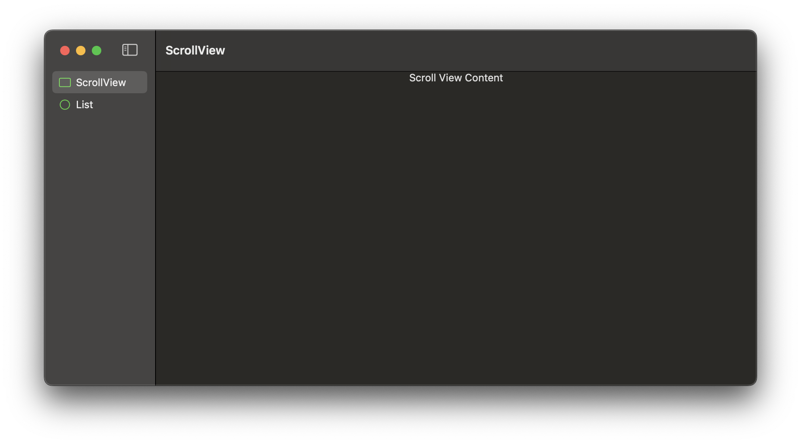
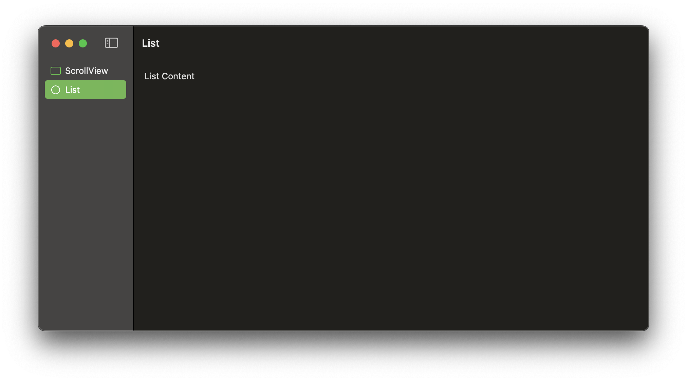
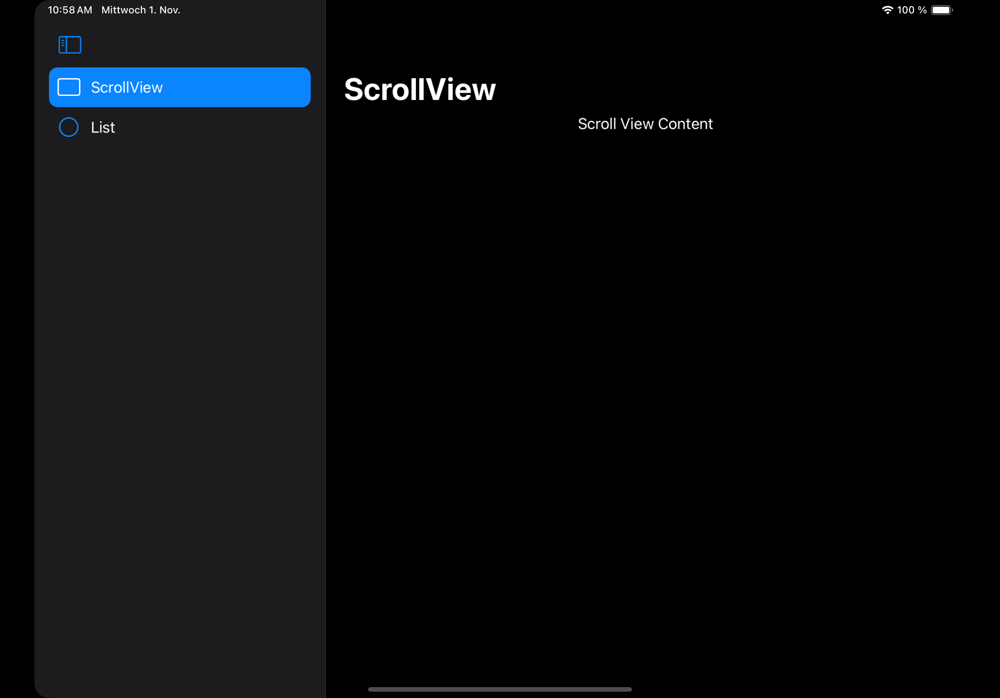
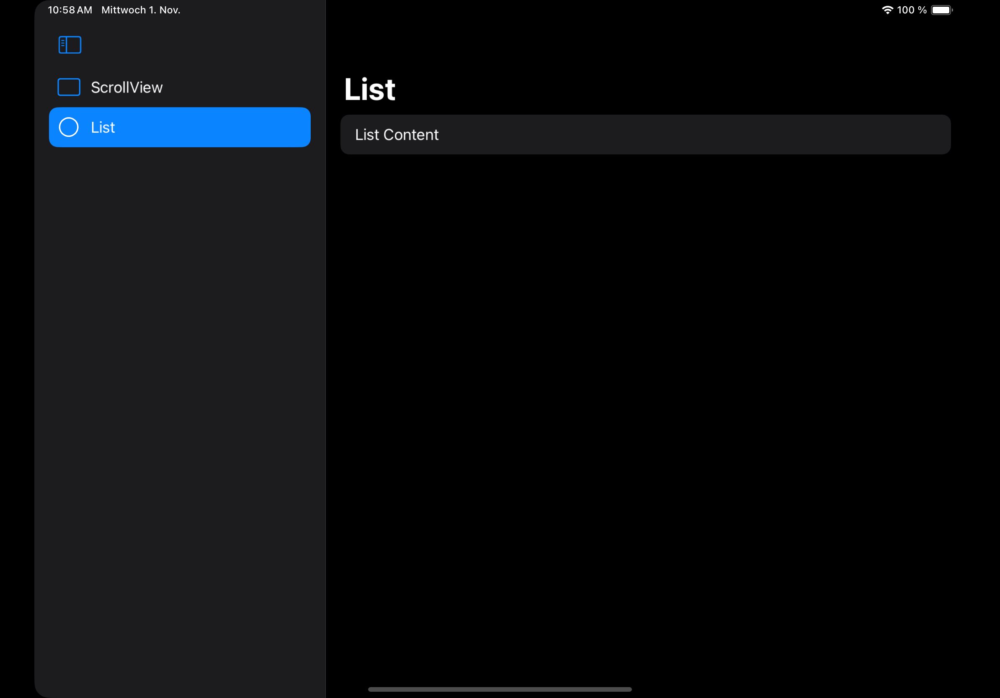

#  FB13322408 - SwiftUI macOS: ScrollView should have the same scroll edge behaviour as List

## Scenario

An app has a SplitView with sidebar and content. The content is either a List or a ScrollView. 

On macOS:
When the List is visible the windowBar has the same color as the List background, only on scroll the bar appears.
When the ScrollView is visible, the bar is always visible.

On iPad:
The navigationBar has the same color as the background, no matter if List or ScrollView.

## The Issue

The behaviour on iPadOS is the same for List and ScrollView.
The behaviour on macOS is different for List and ScrollView and there is no way to adjust the ScrollView to have the same behaviour.

## Suggestion

There should be an option to influence the scroll edge behaviour of ScrollView and List

## Example Code

The example contains a SplitView with a List and a ScrollView. Running it on macOS and iPadOS shows the different behaviour.

## Tested on 

- macOS  14.0
- iPadOS 17.0
